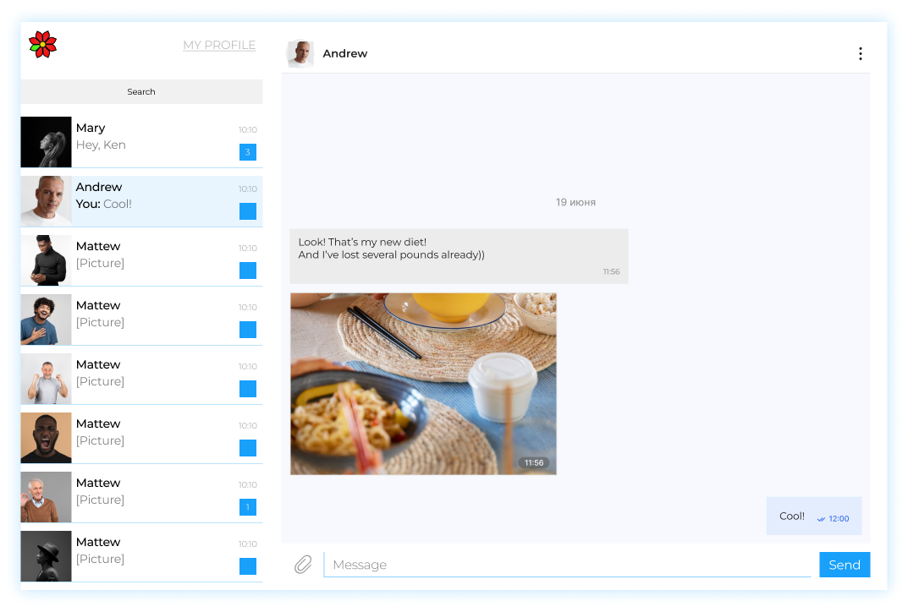

<h1 style="text-align:center"><a href="chatiz.ru">CHAT IZ RU</a> – Official Messenger</h1>

This is the complete source code and the build instructions for the official Chatiz messenger client.
<marquee direction="left" scrollamount="3" style="color:grey">HELLO &#8226; SALUT &#8226; HALLO &#8226; 你好！&#8226; HOLA &#8226; HEJ &#8226; ZDRAVO &#8226; こんにちは &#8226; CIAO &#8226; SALUTON &#8226; </marquee>

---

Deployed chat application:

<a href="chatiz.ru">**CHATIZ.RU**</a>
(mirror domain of NETLIFY)

Application Chatiz is intended to provide connection between people.
 

 

---
## Description

Messenger **Chatiz** has following pages:
1. Sign in page
2. Sign up page
3. Chat page
4. Page with user info
5. Page 404
6. Page 500

Figma prototype: 
https://www.figma.com/file/NTjyUDsZBdhUJWAfTwdU8z/Practicum---Sprint-1?node-id=0%3A1

## Installing

Краткий список команд

- `npm run dev` — starting of dev version,
- `npm run start` — building satble version & starting of expressjs,
- `npm run build` — building satble version
- `npm run lint` — execute linter
- `npm run slint` — execute stylelint

## **Use examples**

-----
### **Team**

-----

### **Examples README**

-----
